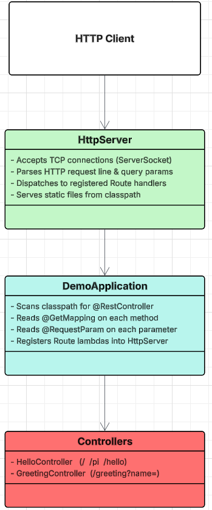
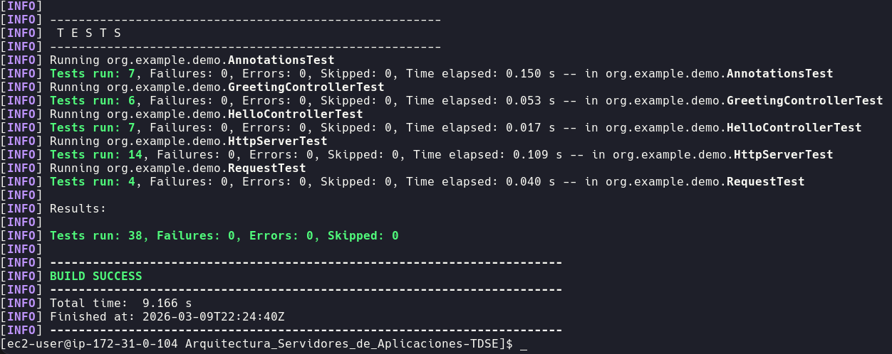
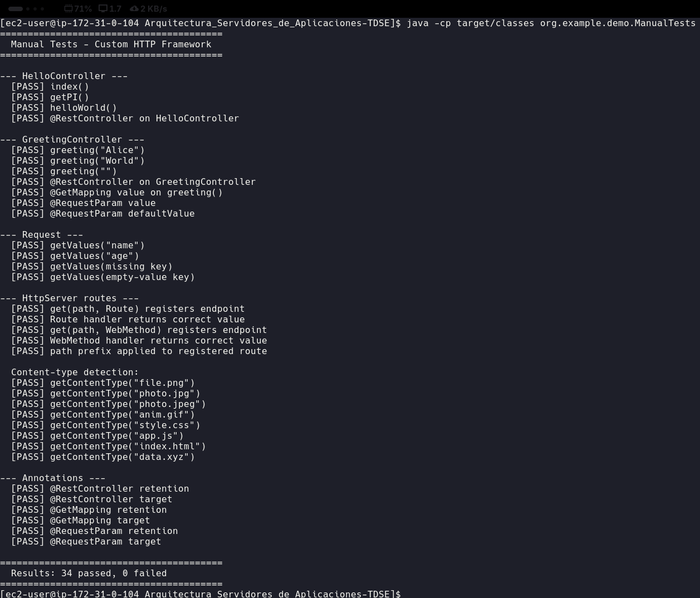
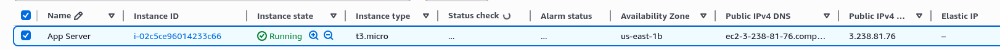
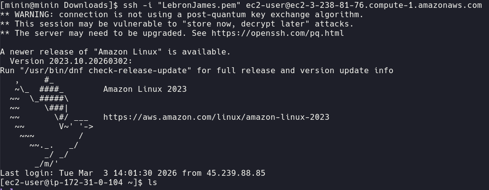
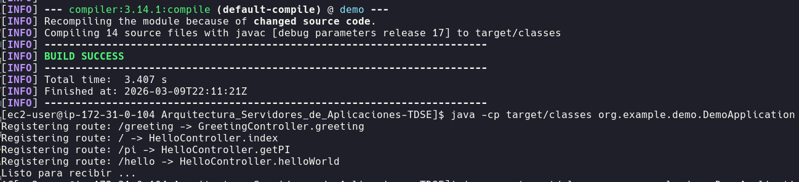
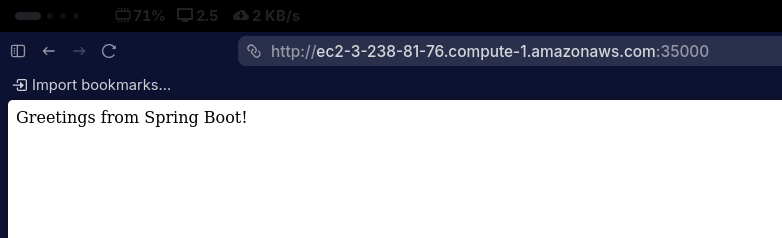
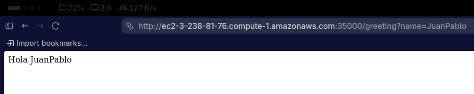

# Arquitectura de Servidores de Aplicaciones

## Juan Pablo Contreras Parra

A custom lightweight web framework built from scratch in Java, demonstrating how annotation-driven HTTP frameworks like Spring Boot work under the hood. The project implements classpath scanning, custom annotations, reflection-based routing, and a raw Java HTTP server.

---

## Table of Contents

1. [Architecture & Design](#architecture--design)
2. [Project Structure](#project-structure)
3. [Installation](#installation)
4. [Running the Server](#running-the-server)
5. [Available Endpoints](#available-endpoints)
6. [Running Tests](#running-tests)
7. [AWS EC2 Deployment](#aws-ec2-deployment)

---

## Architecture & Design

### Overview

The system is composed of four layers:



### Custom Annotations

| Annotation | Target | Purpose |
|---|---|---|
| `@RestController` | Class | Marks a class as a web service component to be discovered during classpath scanning |
| `@GetMapping(value)` | Method | Declares the HTTP GET path that the method handles |
| `@RequestParam(value, defaultValue)` | Parameter | Binds a URL query parameter to a method argument, with optional default |

### Classpath Scanning

`DemoApplication` replicates what Spring's component scan does:

1. Reads `java.class.path` system property to find all classpath entries.
2. Recursively walks every directory, converting `.class` files to fully-qualified class names.
3. Loads each class with `Class.forName()` and checks for `@RestController`.
4. For every annotated class, iterates its methods looking for `@GetMapping`.
5. Builds a `Route` lambda (using reflection to resolve `@RequestParam` arguments) and registers it into `HttpServer.endPoints`.

### Request Lifecycle

```
Browser → TCP connect → ServerSocket.accept()
       → read HTTP request line → parse URI + query string
       → Request object (Map<String, String>)
       → endPoints.get(path) → Route.handle(req, res)
       → controller method invoked via reflection
       → HTML response written to OutputStream
       → socket closed
```

### Key Classes

| Class | Responsibility |
|---|---|
| `DemoApplication` | Entry point; classpath scanner; controller registrar |
| `HttpServer` | Raw TCP server; request parser; route dispatcher; static file server |
| `HelloController` | Handles `/`, `/pi`, `/hello` |
| `GreetingController` | Handles `/greeting?name=` |
| `Request` | Holds parsed query parameters |
| `Response` | Placeholder for future response helpers |
| `Route` | Functional interface: `(Request, Response) → String` |
| `WebMethod` | Simplified functional interface: `() → String` |
| `ManualTests` | Self-contained manual test runner (no test framework required) |

---

## Project Structure

```
src/
├── main/
│   ├── java/org/example/demo/
│   │   ├── DemoApplication.java       # Bootstrap & classpath scanner
│   │   ├── HttpServer.java            # Custom HTTP server (port 35000)
│   │   ├── HelloController.java       # @RestController — basic endpoints
│   │   ├── GreetingController.java    # @RestController — /greeting?name=
│   │   ├── RestController.java        # Custom @RestController annotation
│   │   ├── GetMapping.java            # Custom @GetMapping annotation
│   │   ├── RequestParam.java          # Custom @RequestParam annotation
│   │   ├── Route.java                 # Functional interface for handlers
│   │   ├── WebMethod.java             # Simplified handler interface
│   │   ├── Request.java               # Query parameter DTO
│   │   ├── Response.java              # Response placeholder
│   │   ├── ManualTests.java           # Framework-free test runner
│   │   ├── ReflexionNavigator.java    # Reflection demo utility
│   │   └── InvokeMain.java            # Dynamic main() invoker demo
│   └── resources/
│       └── application.properties
└── test/
    └── java/org/example/demo/
        ├── HelloControllerTest.java
        ├── GreetingControllerTest.java
        ├── RequestTest.java
        ├── HttpServerTest.java
        └── AnnotationsTest.java
```

---

## Installation

### Prerequisites

- Java 17+
- Maven (or use the included `mvnw` wrapper)

### Clone & Build

```bash
git clone <repository-url>
cd Arquitectura_Servidores_de_Aplicaciones-TDSE

# Compile
./mvnw compile
```

---

## Running the Server

### Option 1 — Java classpath

```bash
# Compile first
./mvnw compile

# Run
java -cp target/classes org.example.demo.DemoApplication
```

### Option 2 — Maven exec plugin

```bash
./mvnw exec:java -Dexec.mainClass=org.example.demo.DemoApplication
```

The server starts on **[http://localhost:35000](http://localhost:35000)**.

---

## Available Endpoints

| Method | Path | Query Params | Example Response |
|---|---|---|---|
| GET | `/` | — | `Greetings from Spring Boot!` |
| GET | `/pi` | — | `PI: 3.141592653589793` |
| GET | `/hello` | — | `Hello World` |
| GET | `/greeting` | `name` (default: `World`) | `Hola Alice` |

Example requests:

```bash
curl http://localhost:35000/
curl http://localhost:35000/pi
curl http://localhost:35000/hello
curl http://localhost:35000/greeting?name=Alice
```

---

## Running Tests

### JUnit 5 automated tests

```bash
./mvnw test
```

Expected output:



### Manual test runner (no test framework required)

```bash
# Compile first if needed
./mvnw compile

java -cp target/classes org.example.demo.ManualTests
```

Expected output:



---

## AWS EC2 Deployment

### Instance Details



---

### SSH Connection



```bash
ssh -i "LebronJames.pem" ec2-user@ec2-3-238-81-76.compute-1.amazonaws.com
```

---

### Deploying the Application



---

### Accessing the Application from a Browser





---

### Running Tests on EC2

## Manual Tests


## JUnit Tests


```bash
# JUnit tests
./mvnw test

# OR manual tests
java -cp target/classes org.example.demo.ManualTests
```
